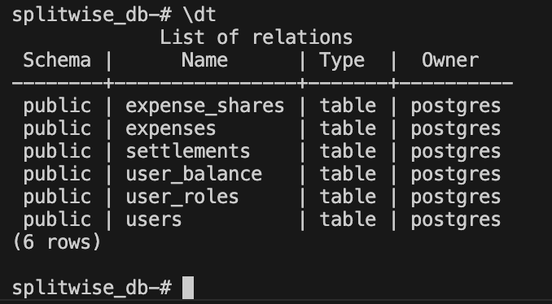

# Expense Sharing Backend
## Overview

This is a backend application built using Spring Boot to manage expenses between users. 
<br/> 
The system allows users <br/> 
        1. to login/ register </br>
        2. to add expenses, view expenses<br/> 
        2.  split/ settle the expense amount equally / unequally/ amount or percentage <br/> 
        3.  view their expenditures <br/> 
        4.  Get their final balances./ Track Balances <br/> 
        5.  Paginated Expense Retrieval <br />


## Features

- **User Management**: Add and manage users.
- **Expense Management**: Create and manage shared expenses.
- **Balance Tracking**: Track balances between users.
- **Payment Settlement**: Settle payments between users.
- **Database Integration**: Uses PostgreSQL for data storage.

---

## Technologies Used In project

- **Java**: Programming language.
- **Spring Boot**: Backend framework.
- **PostgreSQL**: Relational database.
- **Gradle**: Build tool.

## For testing these can be used

- **JUnit 5**: Unit testing framework.
- **Mockito**: Mocking framework for testing.


---

## Prerequisites

Before running the project, ensure you have the following installed:

- **Java 17** or later
- **Gradle** (if not using the wrapper)
- **PostgreSQL** (version 12 or later)
- **Docker** (set up docker locally)

---


## Setup Instructions

### 1. Clone the Repository

```
git clone https://github.com/poojareddy7766/Splitwise-backend-Setu.git 
cd Splitwise-backend-Setu 
```

### 2. Create the PostgreSQL Database

Make sure PostgreSQL is running on your machine. Then, create a database named splitwise_db:{Replace your_username with your actual PostgreSQL username.}
```
createdb -U your_username splitwise_db
```
### 3. Update Database Credentials (replace your username and password)
```
spring.datasource.username=your_username
spring.datasource.password=your_password
```
### 4. Flyway Configuration for Database Migrations (replace your username and password)
```
user = 'your_username'
password = 'your_password'
```
### 5. Run the Flyway Migration
```
./gradlew flywayMigrate
```
### 6. Build the project

```
./gradlew build
```

### 7. Make sure docker is running 

```
open -a Docker
```

### 8. Build the Project using docker 
```
 docker build -t splitwise-backend .
```

### 9. Run the Application
```
 docker run -p 8080:8080 splitwise-backend          
```

The application will start on [http://localhost:8080/](http://localhost:8080/)

### 🧪 API Documentation
Access the Swagger UI to test and explore APIs:
👉 [http://localhost:8080/swagger-ui/index.html](http://localhost:8080/swagger-ui/index.html)


API Endpoints
1. User Registration
   POST /api/auth/register

body: 
```
{
  "email": "yoo5@google.com",
  "name": "Setu ",
  "password": "password123"
}
```

2. Login 
   POST  /api/auth/login

body: 
```
{
  "email": "yoo5@google.com",
  "password": "password123"
}
```
The response is a jwt token. Pass this as a bearer-token in all the other api calls.

3. create expense

body: 
```
{
        "id": 1,
        "description": "shopping",
        "amount": 1000,
        "paidById": 3,
        "splitType": "EQUAL",
        "userShares": {
            "3": 500,
            "2": 500
        }
    }
```

Get All Expenses: GET /expenses<br/>
Get expense with expenseId : GET /expenses/{expenseId}<br/>
Get Expenses for a user, with user Id: GET /expenses/user/{userId}<br/>


4. Balance Tracking <br />
Get All Balances: GET /balances/all
Response:
```
{
    "1": "User 1 owes nothing",
    "2": "User 2 owes a total of {rupees} to {User x, User y}",
    "3": "User 3 owes nothing",
    "4": "User 4 owes nothing",
    "5": "User 5 owes nothing",
    "6": "User 6 owes nothing",
}

```
Get balance of an individual user:

GET /getBalance/{userId}

Response:
```
    {
    "breakdown": [
        {
            "amount": 500.00,
            "owesTo": 3
        }
    ],
    "userId": 2,
    "totalOwed": 500.00
}
```

5. Payment Settlement
Settle Payment: POST /settle
```
{
    "senderId": 2,
    "receiverId": 1,
    "amount": 500
}
```
response:
```
User A has successfully settled payment of ₹x to User B
```

6. Get list of expenses associated with a user, using pagination

```
/expenses/user/2/fetchAll?page=a&size=b
```
replace a and b as per ur wish


## Database Schema


The application uses the following database schema to manage users, expenses, balances, and settlements:

## Tables

1. **users**
   - `id`: Primary key
   - `name`: User's name
   - `email`: User's email

2. **expenses**
   - `id`: Primary key
   - `description`: Expense description
   - `amount`: Total amount
   - `paid_by`: User ID of the payer
   - `split_type`: Type of split (e.g., EQUAL)

3. **user_balance**
   - `id`: Primary key
   - `user_id`: User who owes money
   - `other_user_id`: User who is owed money
   - `balance_amount`: Amount owed

4. **settlements**
   - `id`: Primary key
   - `sender_id`: User who sent the payment
   - `receiver_id`: User who received the payment
   - `amount`: Amount settled

preview:

 

## Future Enhancements

- use refresh tokens -- authorization
- Implement detailed transaction history for users.
- create groups, add members, and split expenses among group members.

## Walkthrough apis

## Demo

Walk through api's in action:

[](https://youtu.be/W52SS_iIlhE?si=0EcHpU1tlRLU2DOp)

Click [here](https://youtu.be/W52SS_iIlhE?si=0EcHpU1tlRLU2DOp) to watch the video on YouTube.
